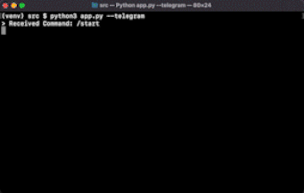

[](https://github.com/artur-varosyan/budgeting-bot/actions/workflows/python-app.yml)

# Budgeting Bot Bubsy

### A personal finance budget-managing tool deployed as a chatbot on the messaging platform Telegram. Bubsy records your expenses, shows your spending and keeps track of your budget.




## Table of Contents
1. [About](#budgeting-bot-bubsy)
2. [Getting Started](#getting-started)
   * [Pre-requisites](#pre-requisites)
   * [Setting up the Database](#setting-up-the-database)
   * [Creating the Telegram Bot](#creating-the-telegram-bot)
   * [Configuration](#configuration)
3. [Usage](#usage)
   * [Starting the bot](#starting-the-bot)
   * [Conversing with the bot](#conversing-with-the-bot)
5. [Deployment](#deployment)
6. [Future Improvements](#future-improvements)

# Getting Started

## Pre-Requisites
To run the application you will need the following:
* **Python 3.9+**
* SQL Relational Database

<br>

To install the required Python packages:
```
pip install -r requirements.txt
```
<br>

Note: To communicate with the bot via the messaging platform Telegram you need [Telegram](https://telegram.org/) account and application.

## Setting up the Database
The application requires an SQL relational database to work. To set up your database you may use the scripts provided in **db/** directory.
* **db/createtables.sql** creates the required tables in the database
* **db/importdata.sql, db/categories.csv, db/budget.csv, db/spending.csv** can be used to prefill the database with some data if you wish.


## Creating the Telegram Bot
(Optional) To converse with the bot through the messaging platform Telegram, you will need to create the bot using the application. You may find the instructions on how to do this [here](https://core.telegram.org/bots#6-botfather). Once you have your _bot token_ you can proceed with the configuration as shown below.


## Configuration
The application contains two configuration files you must fill in before running the bot:

* **src/db_config.json** <br>
  The configuration settings for the database.
  ```json
  {
  "dbHost": "localhost",
  "dbName": "budget",
  "dbUser": "bubsy"
  }
  ```
  
* **src/telegram_config.json** <br>
  _(Optionally) The configuration settings for the Telegram bot._
  ```json
  {
    "token": "token",
    "privateBot": true,
    "chatId": 0
  }
  ```
  To obtain the _chatId_ and secure your bot, you may run the application with the flags as follows: <br>
  `python app.py --telegram --identify-users` <br>
  This will echo the _chatId_ of all incoming messages to the bot with the given token.

# Usage

## Starting the bot

You may run the application by: <br>
* `python app.py --terminal` to converse with the bot in the terminal, or alternatively, <br>
* `python app.py --telegram` (default) to use the messaging platform Telegram

## Conversing with the bot
Some of the features that Bubsy currently supports include:
* recording an expense
* showing your budget
* showing your spending in a specified time frame
* changing your budget
* warning you when your spending is close or above your budget limits

Try sending these messages:
* `I spent £5 on transport yesterday` or
* `Show me my budget` or
* `How much did I spend last weekend?` 

# Deployment
The application has been deployed on an EC2 AWS instance.

# Future Improvements
Some of the features I plan to add to the project:
* Support for keeping track of recurring payments
* Showing a spending graph via Google Sheets API

To see an up-to-date list of features I am currently working on, see the [issues section]() of the repository.
